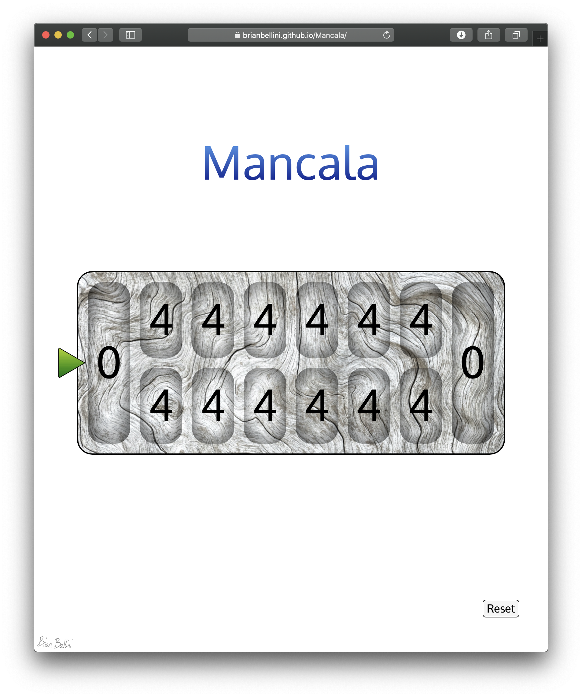

<h1>Mancala</h1>
<h3>Project 1</h3>

<h4>Technologies Used:</h4>

	HTML
	CSS
	JavaScript

<h4>Game Background:</h4>

	This is a basic version of the ancient game of Mancala.
	This variant is known as "Two-rank Mancala" or "Kalah".

<h4>Getting Started:</h4>

	Link to play Game:

	Basics:
	Game starts with Green player (Indicated by green triangle on left).
	Once turn ends, player changes to Red (Indicated by red triangle on right).

	Green owns the top row of pockets, Red owns the bottom row of pockets.

<h4>Game play:</h4>

	To win the game collect the highest number by the end of the game.

	Click on a pocket to collect the stones from that pocket.

	Moving counter clockwise one stone is placed in each of the pockets.

	If you pass your own home pocket you get to keep that stone.
	If you pass your oponents pocket you get to skip placing a stone there.

	If the last stone you drop is in your own home pocket, you get another turn.

	If the last stone you drop is in an empty pocket on your own side:
	You get to take all the stones in the pocket directly opposite.

	The game is over when all the pockets on one side are empty.

	The player that owns the other side gets to take all of the stones on their side.

	THe winner has the most stones once the game is complete.
	

<h4>Roadmap considerations:</h4>

	Randomizing start player
	Instruction popover
	Scenario based lessons
